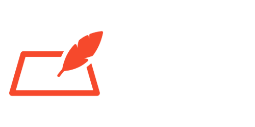

<p align="left">
    
</p>

Quill is a simple, lightweight and easy-to-use scripting language designed for interactive fiction and branching dialog written in Go. Dialog is written in a natural, human-readable format, making it accessible for writers and developers alike.

> [!IMPORTANT]
> This project is still in development and is missing some features. If you encounter any issues, please open an issue on GitHub.

```python
LABEL start

ELIZABETH: "It is a truth universally acknowledged..." [pride]
DARCY: "That a single man in possession of a good fortune..." [pride]
ELIZABETH: "Must be in want of a wife!"

CHOICE {
    "Ask about Mr. Darcy's fortune" {
        ELIZABETH: "And what is your fortune, sir?"
        DARCY: "My income is considerable."
    },
    "Change the subject" {
        ELIZABETH: "Shall we discuss the weather?"
        GOTO weather
    }
}

LABEL weather
DARCY: "The grounds are quite pleasant today."

CHOICE {
    "Return to start" { GOTO start },
    "Take your leave" { GOTO ending }
}

LABEL ending
ELIZABETH: "Good day, Mr. Darcy."
END
``` 
For a comprehensive example showcasing all available syntax features, please refer to [syntax.q](/examples/syntax.q)!
